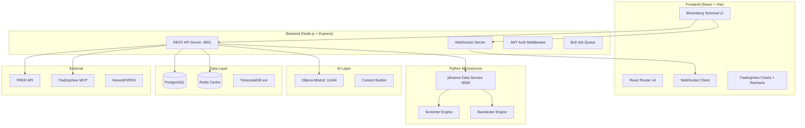

# 🏛️ QuantDesk — Bloomberg-Grade Trading Terminal

### Master Architecture & 7-Day Build Plan

---

> [!IMPORTANT]
> **Current State**: You have a working Streamlit app (`app.py`) with 6 pages, yfinance data, Ollama/Claude AI, FRED macro, TradingView MCP integration, and a portfolio tracker. We are **migrating this to a full-stack Node.js + React monorepo** while preserving and massively expanding every feature.

---

## 🎯 What We're Building

**QuantDesk** — A self-hosted, multi-user, Bloomberg-equivalent financial terminal for retail traders and prop desks.

| Dimension | Spec |
|---|---|
| **Stack** | React 18 + Vite (frontend) · Node.js + Express (backend API) · PostgreSQL + Redis (data) |
| **AI** | Ollama Mistral (local, $0 cost) |
| **Market Data** | yfinance (Python microservice) · TradingView widget embeds · FRED API |
| **Users** | Multi-user SaaS with JWT auth · starts at 10, scales to 10k |
| **Markets** | US · India (NSE/BSE) · Global · Equities · Options · Futures · Crypto · Forex |
| **Hosting** | 100% self-hosted, zero recurring cost |
| **Desktop** | Electron wrapper around the React app |

---

## 🏗️ System Architecture



---

## 📁 Project Structure

```
stock_market_analyst/
├── frontend/                    # React + Vite app
│   ├── src/
│   │   ├── pages/
│   │   │   ├── Dashboard/       # Main Bloomberg-style terminal
│   │   │   ├── Screener/        # Stock/options/crypto screener
│   │   │   ├── Backtester/      # Strategy backtesting
│   │   │   ├── Portfolio/       # Portfolio & position tracking
│   │   │   ├── Options/         # Options chain, Greeks
│   │   │   ├── Crypto/          # Crypto + DeFi dashboard
│   │   │   ├── Forex/           # Currency pairs
│   │   │   ├── Macro/           # Global macro, yield curves
│   │   │   ├── News/            # News + sentiment
│   │   │   ├── Alerts/          # Price & signal alerts
│   │   │   ├── Research/        # AI-powered research reports
│   │   │   ├── Analytics/       # Risk analytics
│   │   │   └── Settings/        # User settings, API keys
│   │   ├── components/
│   │   │   ├── Terminal/        # Bloomberg-style panels
│   │   │   ├── Charts/          # TradingView + custom charts
│   │   │   ├── OrderBook/       # Level 2 simulation
│   │   │   └── AI/              # AI chat, summaries
│   │   ├── store/               # Zustand state management
│   │   ├── hooks/               # Custom React hooks
│   │   └── api/                 # API client layer
│   ├── package.json
│   └── vite.config.js
├── backend/                     # Node.js Express API
│   ├── src/
│   │   ├── routes/
│   │   ├── middleware/
│   │   ├── services/
│   │   └── models/
│   └── package.json
├── py-service/                  # Python data microservice
│   ├── main.py                  # FastAPI server
│   ├── screener.py
│   ├── backtester.py
│   └── requirements.txt
├── electron/                    # Desktop app wrapper
│   └── main.js
└── docker-compose.yml           # PostgreSQL + Redis
```

---

## 📊 Bloomberg Feature Parity (15-20 Features)

| # | Bloomberg Feature | Our Implementation |
|---|---|---|
| 1 | **Multi-panel terminal layout** | CSS Grid drag-and-drop panels |
| 2 | **Real-time quotes & watchlist** | WebSocket + yfinance streaming |
| 3 | **Advanced charting (OHLCV)** | TradingView Lightweight Charts |
| 4 | **Options chain + Greeks** | yfinance options + py calculations |
| 5 | **Screener with 50+ filters** | Python screener engine |
| 6 | **Portfolio P&L tracking** | PostgreSQL + real-time valuation |
| 7 | **News + sentiment NLP** | NewsAPI + Ollama sentiment |
| 8 | **Backtesting engine** | Python Backtrader integration |
| 9 | **Risk analytics (VaR, beta)** | Python risk module |
| 10 | **Yield curve & macro data** | FRED API integration |
| 11 | **Sector heatmaps** | D3.js treemap |
| 12 | **Alert system** | Node.js Bull Queue + WebSocket push |
| 13 | **AI research reports** | Ollama Mistral PDF/HTML export |
| 14 | **Historical data depth** | yfinance up to max period |
| 15 | **Multi-market support** | US/India/Global ticker routing |
| 16 | **ETF analyzer & peer compare** | yfinance ETF data |
| 17 | **Earnings calendar** | yfinance calendar endpoint |
| 18 | **Crypto + Forex dashboards** | yfinance crypto/forex feeds |
| 19 | **Custom watchlists per user** | PostgreSQL per-user data |
| 20 | **Export reports (PDF/CSV)** | Puppeteer PDF generation |

---

## 📅 7-Day Build Plan

### Day 1 — Foundation & Auth

- [ ] Initialize React + Vite frontend (`frontend/`)
- [ ] Initialize Node.js + Express backend (`backend/`)
- [ ] PostgreSQL + Redis via Docker Compose
- [ ] JWT authentication (register/login/sessions)
- [ ] Bloomberg-style terminal layout shell (dark theme, panels)
- [ ] User management & multi-tenant schema

### Day 2 — Data Pipeline & Screener

- [ ] FastAPI Python microservice (port 8000) wrapping yfinance
- [ ] REST endpoints: quotes, OHLCV, fundamentals, options chain
- [ ] Redis caching layer (TTL per data type)
- [ ] Stock screener with 20+ filters (P/E, volume, momentum, etc.)
- [ ] Screener UI with sortable table + export

### Day 3 — Charts & Dashboard

- [ ] TradingView Lightweight Charts integration
- [ ] Multi-timeframe OHLCV charts
- [ ] Dashboard: watchlist, sector heatmap, top movers
- [ ] Earnings calendar widget
- [ ] Market breadth indicators

### Day 4 — Portfolio & Options

- [ ] Portfolio tracker: add/edit/delete positions
- [ ] Real-time P&L, cost basis, unrealized gains
- [ ] Options chain display with Greeks (Delta, Gamma, Theta, Vega)
- [ ] Risk analytics: VaR, beta, Sharpe ratio
- [ ] Allocation pie charts and sector breakdown

### Day 5 — AI & Research

- [ ] Ollama Mistral integration (streaming responses)
- [ ] AI stock analysis reports (bull/bear thesis, price targets)
- [ ] News aggregator + Ollama sentiment scoring
- [ ] AI-powered portfolio review
- [ ] PDF report generation (Puppeteer)

### Day 6 — Alerts, Backtester & Advanced

- [ ] Alert engine (price, volume, RSI/MACD triggers)
- [ ] WebSocket push notifications
- [ ] Backtesting engine (Backtrader via Python service)
- [ ] Strategy results: equity curve, max drawdown, Sharpe
- [ ] Macro page: yield curve, FRED data

### Day 7 — Desktop App, Multi-user & Polish

- [ ] Electron wrapper for desktop app
- [ ] Multi-user role system (admin, trader, viewer)
- [ ] India market support (NSE/BSE via yfinance suffix)
- [ ] Crypto + Forex dashboards
- [ ] Performance optimization, caching, load testing

---

## ⚙️ Tech Stack Summary

| Layer | Tech | Why |
|---|---|---|
| Frontend | React 18 + Vite | Fast HMR, modern ecosystem |
| UI Framework | Custom CSS (Bloomberg dark) | Full control, premium look |
| State | Zustand | Simple, performant |
| Charts | TradingView Lightweight Charts | Free, professional quality |
| Backend | Node.js + Express | Fast I/O, great WS support |
| Data Service | Python FastAPI + yfinance | Existing Python expertise |
| Database | PostgreSQL + TimescaleDB | Time-series + relational |
| Cache | Redis | Real-time data caching |
| AI | Ollama Mistral (local) | Free, private, fast |
| Desktop | Electron | Wrap the web app |
| Auth | JWT + bcrypt | Simple, stateless |
| Queue | Bull (Redis-backed) | Alert scheduling |

---

## 🚀 Getting Started (Next Steps)

The first action is:

1. **Keep your Streamlit app running** as a reference
2. **Scaffold the new monorepo** structure alongside it
3. Build Day 1 deliverables: auth + terminal shell

> [!NOTE]
> Your existing Python modules (`lib/`, `pages/`) will be **reused as the FastAPI microservice** — not thrown away. The migration is additive, not destructive.

> [!TIP]
> The Electron desktop app is literally a shell around the web app — it requires minimal extra work. Build the web app correctly and the desktop version is nearly free.
